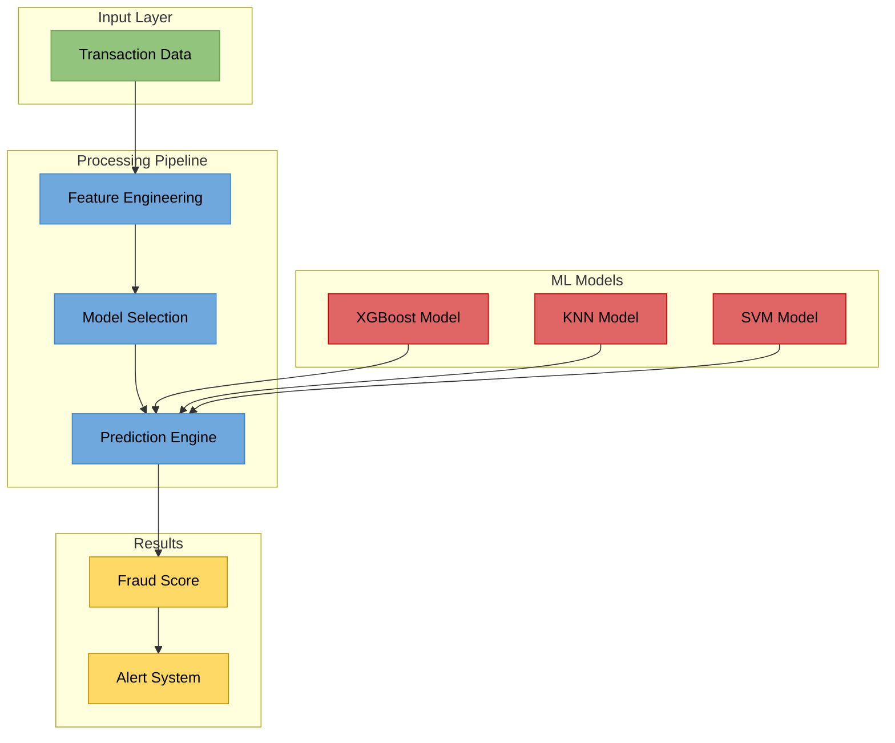
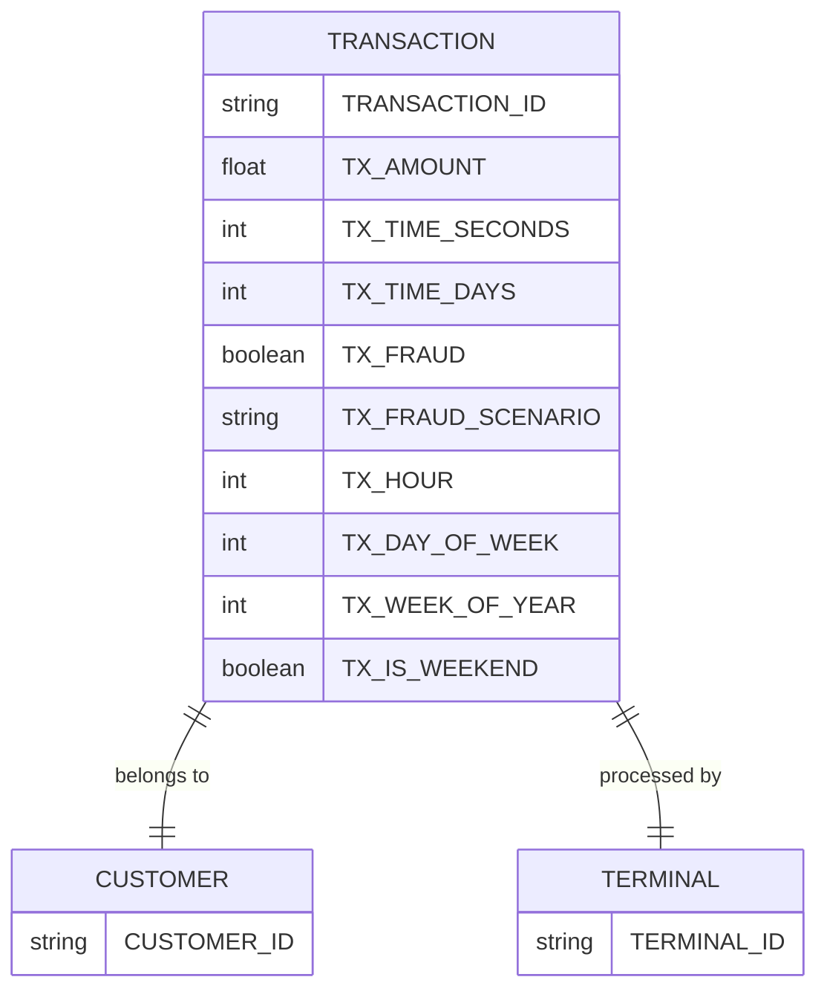

# 🕵️ Fraud Transaction Detection
check at  this url
https://fraudtransactiondetection-uee8kzouwxas9pc3rve5mc.streamlit.app/

This is an end-to-end machine learning project to detect fraudulent financial transactions using a stacking ensemble model (Random Forest + XGBoost). It includes preprocessing, modeling, evaluation, prediction, and a user-friendly Streamlit web app.


##  Key Features

- Real-time transaction risk evaluation
- Multi-model approach for improved accuracy
- Comprehensive feature engineering pipeline
- Scalable architecture for production deployment
- Detailed performance metrics and monitoring

##  Architecture Overview

The system employs a modular design with clear separation of concerns, ensuring maintainability and scalability.



The architecture diagram above illustrates the system's four main layers:

- Green: Input layer handling raw transaction data
- Blue: Processing pipeline managing feature engineering and model selection
- Red: ML models (XGBoost, KNN, SVM) contributing to predictions
- Yellow: Results layer generating fraud scores and triggering alerts

Each transaction flows through the feature engineering pipeline before being evaluated by multiple machine learning models. The Prediction Engine combines outputs from all models to generate a final fraud score, which triggers alerts based on configurable thresholds.

##  Technical Implementation

### Core Components

```markdown
fraud_transaction_detection/
├── src/
│   ├── features/
│   │   └── feature_engineering.py
│   ├── models/
│   │   ├── xgboost_model.py
│   │   ├── knn_model.py
│   │   └── svm_model.py
│   ├── pipeline/
│   │   └── prediction_pipeline.py
│   └── utils/
│       └── metrics.py
└── notebooks/
    └── analysis.ipynb
```

##  Model Comparison

| Model | Balanced Accuracy | Precision | Recall | F1 Score |
| --- | --- | --- | --- | --- |
| XGBoost | 0.881 ± 0.017 | 0.963 ± 0.007 | 0.763 ± 0.035 | 0.851 ± 0.023 |
| KNN | 0.705 ± 0.037 | 0.942 ± 0.022 | 0.409 ± 0.074 | 0.568 ± 0.073 |
| SVM | 0.595 ± 0.013 | 1.000 ± 0.000 | 0.190 ± 0.026 | 0.319 ± 0.037 |
### Requirements


##  Performance Metrics

| Metric | Value | Notes |
| --- | --- | --- |
| Balanced Accuracy | 0.881 ± 0.017 | Based on cross-validation |
| Precision | 0.963 ± 0.007 | On unseen data |
| Recall | 0.763 ± 0.035 | On unseen data |
| F1 Score | 0.851 ± 0.023 | Overall performance measure |

Here's your data structure diagram:



The diagram shows how your transaction data is organized:

- Each transaction belongs to exactly one customer and is processed by exactly one terminal
- Fields are grouped into logical categories:
  - CUSTOMER: Customer identification
  - TERMINAL: Terminal identification
  - TRANSACTION: Core transaction details and fraud information


Here are your data attributes in table format:

| Field Name | Purpose | Format | Use Case | Importance |
| --- | --- | --- | --- | --- |
| TRANSACTION_ID | Unique identifier for each transaction | String | Transaction tracking and audit trails | Essential for fraud investigation |
| CUSTOMER_ID | Identifies customer account | String | Customer behavior analysis | Critical for pattern recognition |
| TERMINAL_ID | Identifies processing terminal | String | Terminal security monitoring | Key for location tracking |
| TX_AMOUNT | Transaction amount in currency | Float | Fraud detection algorithms | Primary fraud indicator |
| TX_TIME_SECONDS | Precise transaction timestamp | Integer | Micro-level pattern analysis | Enables rapid fraud detection |
| TX_TIME_DAYS | Transaction timestamp in days | Integer | Long-term pattern analysis | Supports trend analysis |
| TX_HOUR | Hour of day (0-23) | Integer | Peak fraud hour identification | Time-based risk assessment |
| TX_DAY_OF_WEEK | Day of week (1-7) | Integer | Weekly pattern analysis | Behavioral pattern recognition |
| TX_WEEK_OF_YEAR | Week number in year (1-52) | Integer | Seasonal pattern analysis | Long-term trend analysis |
| TX_IS_WEEKEND | Weekend indicator | Boolean | Weekend vs. weekday analysis | Risk profile adjustment |
| TX_FRAUD | Fraud status indicator | Boolean | Fraud detection training | Core target variable |
| TX_FRAUD_SCENARIO | Fraud type categorization | String | Fraud pattern analysis | Strategy development |

```bash
pip install -r requirements.txt
```

##  Usage

```python
from fraud_transaction_detection.pipeline import PredictionPipeline

# Initialize pipeline
pipeline = PredictionPipeline()

# Make predictions
transaction_data = {
    'amount': 1000.0,
    'old_balance': 5000.0,
    'new_balance': 4000.0,
    # ... other features
}
fraud_score = pipeline.predict(transaction_data)

# Get detailed prediction results
results = pipeline.get_prediction_details()
print(f"Fraud Score: {results['score']:.4f}")
print(f"Model Confidence: {results['confidence']:.4f}")
```


##  Contributing

Fork the repositoryCreate a feature branchRun tests: `pytest src/tests/`Submit pull request with documentation updates##  License

MIT License

Permission is hereby granted, free of charge, to any person obtaining a copy of this software and associated documentation files (the "Software"), to deal in the Software without restriction,

